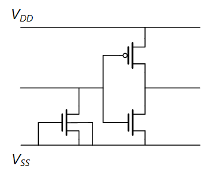

# 1. 半导体物理的一些理解
## 1.1 PN Junction
理想二极管方程：$J=J_s\left[\exp \left(\frac{e V_a}{k T}\right)-1\right]$  
齐纳击穿（Zener Breakdown） → 可恢复 → 隧穿 → BTBT
雪崩击穿（Avalanche Breakdown） → 不可恢复 → 碰撞

## 1.2 MOSFET
MOSFET 可以看作是一个漏电的可变电容，时间短为可变电容，时间长则漏电。
MOSFET 是一个电压控制性电流源，电压激发的器件其电流为指数型曲线。
（需理解）对长沟道NMOS而言，Bulk 加负压或者 Source 加正压，Vt 升高。
（需公式理解）N管不传高压，有Vt损失，P管可传高压，没有Vt损失。
（B比较小，容易扩散，传高压发热使结变大，有 Rel Concern）

**非饱和区电流公式：**
$$ I_D=\frac{W \mu_n C_{\mathrm{ox}}}{2 L}\left[2\left(V_{G S}-V_T\right) V_{D S}-V_{D S}^2\right]$$

$k_n^{\prime}=\mu_n C_{o x}$ 称为 n 沟道 MOSFET 的器件跨导参数, 单位为 $\mathrm{A} / \mathrm{V}^2 ; K_n=\left(W \mu_n C_{\mathrm{ox}}\right) / 2 L=\left(k_n^{\prime} / 2\right) \cdot(W / L)$ 称为 n 沟道 MOSFET 的器件跨导系数, 单位也为 $\mathrm{A} / \mathrm{V}^2$。

**饱和区电流公式：**
$$I_D=\frac{W \mu_n C_{\mathrm{ox}}}{2 L}\left(V_{G S}-V_T\right)^2$$
Source 和 Drain 之间的饱和电压：
$V_{D S}(\mathrm{sat})=V_{G S}-V_T$

## 1.3 MOSFET 的十个寄生效应 
（之后补充以下所有效应的具体公式）
### 1.3.1 Long Channel
Body Effect, Pinch Off, Saturation### 

### 1.3.1 Avoid
Short Channel Effect, DIBL, PuchThrough

### 1.3.1 Parasite Effect
Tunneling, BTBT, GIDL, HCI  
(BTBT, GIDL: 从 Id-Vg Curve 能看出来，从 Is-Vg Curve 看不出来)

## 1.4 Note
弛豫现象：待补充
高低频电路分界线：$>\frac{1}{10 \mathrm{ns}}$

# 2 Circuit
## 2.1 ESD Circuit
### 2.1.1 Type I : Control and I/O Pin
Openshort test，通电流，应看到 0.7V。
所以 CE Pin 在图中位置，芯片大部分时间是不工作的，通高压让电路关闭。
 

(需了解) 然后介绍了这个电路和 Snapback。

### 2.1.2 Type II: Power Pin

当 VDD 有脉冲 15V 时，红圈处约 12V，对于下一个非门，效果就更好。在足够短的时间内将脉冲电压导走，也就是开启最后那个管子，三级保证了时间短。
Powershort 测试 force 电流测电压，看到 0.7V 压降。 SPEC：0.2V ~ 2V。Powershort 的电压可以很低，保证没有管子打开，避免 Floating （例如 VCC 处为 0.2V）带来的瞬态电流过大，而这并不是 short。

### 2.1.3 Type III: HV Pin

ESD 电路需要抗各种频率，对于低频脉冲，当然希望降低 C，但是此情况下高频无法预防，所以 HV PIN 的 ESD 电路设计很难。

## 2.2 Analog Circuit

### 2.2.1 NMOS 反相器

### 2.2.2 放大器

### 2.2.3 基准源

### 2.2.4 Clock

### 2.2.5 Charge Pump

### 2.2.6 数学

# 3 NAND

